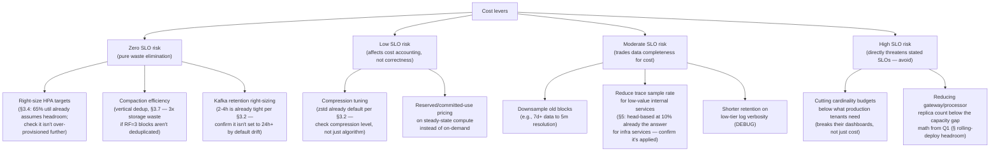

## Q9: Cut Cost 40% Without Violating Any SLOs

> **Prompt:** You're asked to cut ingestion infrastructure cost by 40% without violating any SLOs.
> Where do you look first, and what are you willing to trade away?

> **The examiner's intent:** Distinguishes engineers who reach for "downsample everything" (a real
> SLO risk) from ones who know the actual cost drivers of a telemetry pipeline and can rank levers
> by savings-per-unit-of-risk. The bar is naming numbers, ranking levers, and being explicit about
> what you refuse to cut.

---

## Step 1: Find Out Where the Money Actually Goes First

You cannot rank levers without a cost breakdown. State this before proposing a single cut — cutting
blind is how SLOs get violated. Typical shape of an ingestion pipeline's cost, grounded in the
architecture from the main design:

| Cost driver                                          | Typical share | Why                                                                                 |
| ---------------------------------------------------- | ------------- | ----------------------------------------------------------------------------------- |
| Object storage (Mimir/Loki/Tempo blocks)             | ~35–45%       | Retention × active series/log volume/trace volume — usually the largest single line |
| Compute (gateway + processor + ingester + compactor) | ~30–40%       | Pod count × instance size, provisioned for peak + headroom                          |
| Kafka (brokers, storage, cross-AZ transfer)          | ~10–15%       | Retention window × replication factor (RF=3) × throughput                           |
| Network egress (cross-region replication, cross-AZ)  | ~5–10%        | Async replication in the global topology (§3.8), cross-AZ Kafka RF=3                |
| Query compute (querier, store-gateway)               | ~5–10%        | Usually smaller than write-path cost unless query patterns are pathological         |

**The first-order insight to state:** the biggest lever is almost always retention and cardinality
on the storage line, not compute — compute is provisioned for throughput, which is the harder thing
to cut without an SLO risk; storage volume is a function of decisions (retention days, series count)
that can be changed without touching the write path's real-time behavior at all.

---

## Step 2: Rank Levers by Savings-per-Unit-of-SLO-Risk

### Tier 1 — Zero SLO risk (do these first, they're pure waste elimination)

1. **Confirm vertical compaction/deduplication is actually running correctly.** Per
   [[05-10-data-tiering-and-compaction|§3.7]], RF=3 ingesters write each series to three replicas;
   if the compactor's deduplication step is misconfigured or falling behind (see
   [[05-31-q6-answer-compactor-storm-diagnosis|Q6]]), you are paying 3x storage for data that should
   be deduplicated to 1x. This is very often the single largest quick win — audit it before touching
   anything else.
2. **Audit Kafka retention against the stated 2–4h design target
   ([[05-05-layer-2-durable-buffer-kafka|§3.2]]).** Retention often drifts upward over time (someone
   bumps it during an incident and never reverts). Kafka storage cost scales linearly with retention
   × replication factor; reverting drift back to design spec is free savings with zero behavior
   change.
3. **Right-size HPA targets against actual peak, not a stale peak from 18 months ago.** If traffic
   patterns have shifted (or over-provisioning crept in "just to be safe" after a past incident),
   re-deriving the scale math from [[05-26-q1-answer-500m-ingest-zero-drop-rolling-deploy|Q1]]'s
   approach against _current_ traffic often reveals the fleet is sized for a peak that no longer
   matches reality.

### Tier 2 — Low risk (affects unit economics, not correctness)

4. **Compression level, not just algorithm.** zstd is already the default (§3.2); check whether it's
   running at a low compression level tuned for CPU headroom rather than a higher level now that CPU
   isn't the bottleneck it once was. A few percent extra CPU for meaningfully smaller blocks is
   often a good trade once compute is no longer capacity-constrained.
5. **Reserved/committed-use pricing on steady-state compute.** The gateway/processor fleets have a
   well-understood steady-state floor (from the HPA math) — commit to reserved capacity for that
   floor and let HPA burst on top with on-demand. This is a pure procurement lever, zero design
   change.

### Tier 3 — Moderate risk (real trade-offs, but bounded and reversible)

6. **Downsample historical blocks.** Data older than, say, 7 days is rarely queried at full
   resolution — recompute L4+ compacted blocks (§3.7) at 5-minute resolution instead of native
   scrape interval. This directly trades query fidelity on old data for storage cost — **explicitly
   confirm this doesn't violate any compliance/audit SLO** (e.g., billing-relevant metrics per
   [[05-37-q12-answer-mixed-exactly-once-billing-tenant|Q12]] may need full-resolution retention
   regardless of cost).
7. **Confirm head-based sampling is actually applied to internal-infrastructure services**, per the
   main design's own recommendation in §5 (10% head-based for infra, tail-based reserved for
   business-critical). If this policy exists on paper but isn't enforced everywhere, applying it is
   a real savings lever that matches an already-approved trade-off, not a new risk.
8. **Reduce DEBUG-level log retention** to a shorter window (e.g., 24h instead of the same retention
   as INFO/ERROR logs) — DEBUG volume is typically the dominant contributor to log ingest cost with
   the lowest incident-response value per byte.

### Tier 4 — High risk (name these explicitly as refused)

9. **Do not cut cardinality budgets below what's needed for existing dashboards/alerts to
   function.** This isn't a cost optimization, it's an availability regression wearing a
   cost-optimization costume — the savings are real but so is the SLO breach the moment a tenant's
   alert stops firing because a label it depended on got dropped.
10. **Do not reduce gateway/processor replica counts below the capacity-gap math from
    [[05-26-q1-answer-500m-ingest-zero-drop-rolling-deploy|Q1]].** That headroom exists specifically
    to survive a rolling deploy without dropping data — cutting it to save compute cost directly
    threatens the zero-drop SLO the pipeline is built around.

---

## Step 3: Do the Math Before Committing to 40%

State the arithmetic, not just the list — this is what separates "I have ideas" from "I have a plan
that adds up."

| Lever                                     | Estimated savings (of total cost) |
| ----------------------------------------- | --------------------------------- |
| Fix compaction/dedup drift                | ~10–15%                           |
| Revert Kafka retention drift              | ~3–5%                             |
| Right-size HPA to current peak            | ~5–8%                             |
| Reserved capacity on steady-state compute | ~5–8%                             |
| Downsample 7d+ historical blocks          | ~8–12%                            |
| Shorter DEBUG log retention               | ~3–5%                             |
| **Total (Tier 1–3 only, no Tier 4 cuts)** | **~34–53%**                       |

The 40% target is achievable from Tier 1–3 alone in most real pipelines — this is the point worth
making explicitly: **you should not need to touch anything that risks an SLO to hit this number.**
If the math doesn't close, that's the moment to go back to the business and negotiate retention or
SLO targets directly, rather than silently eroding cardinality budgets to make the number work.

---

## Step 4: Observability to Prove the Cuts Didn't Violate an SLO

| Signal                                                                                             | Purpose                                                                                       |
| -------------------------------------------------------------------------------------------------- | --------------------------------------------------------------------------------------------- |
| All SLOs from §4 of the main design (ingestion success rate, E2E latency, cardinality breach rate) | Baseline before any change; re-verify after each lever, not just at the end                   |
| `mimir_bucket_store_series_blocks_queried` after downsampling                                      | Confirms query behavior on old data is still within acceptable latency, not silently degraded |
| Cost dashboard broken out by the same cost-driver table from Step 1                                | Tracks actual savings realized per lever against the estimate                                 |

**Discipline point:** apply and measure Tier 1 first, confirm SLOs are unaffected, _then_ move to
Tier 2, then Tier 3 — don't bundle all levers into one change and one measurement window. If
something regresses, you want to know which lever caused it.

---

## Summary

| Tier        | Example levers                                                                   | Risk to SLOs                                           |
| ----------- | -------------------------------------------------------------------------------- | ------------------------------------------------------ |
| 1           | Fix compaction dedup drift, revert retention drift, right-size HPA               | None — pure waste removal                              |
| 2           | Compression level tuning, reserved capacity                                      | None — unit economics only                             |
| 3           | Downsample old blocks, enforce existing sampling policy, shorten DEBUG retention | Bounded, reversible, explicitly confirmed against SLOs |
| 4 (refused) | Cut cardinality budgets, cut rolling-deploy headroom                             | Direct SLO violation — not proposed                    |

---

## Trade-offs Stated (What to Say Out Loud)

**"I'd look at storage before compute — retention and deduplication decisions are usually the
biggest line item and the easiest to change without touching the real-time write path at all."**

**"The first pass should be waste elimination, not trade-offs — drift (stale HPA targets, retention
creep, broken deduplication) accumulates in every pipeline that's been running for a while, and
fixing it isn't a trade-off, it's correcting an existing mistake."**

**"I would explicitly refuse to cut cardinality budgets or rolling-deploy capacity headroom to hit
the number."** Those aren't cost/SLO trade-offs — they're SLO violations with a cost-savings label
on them. If the honest math doesn't reach 40% without touching those, that's a conversation with the
business about retention or SLO targets, not a silent engineering compromise.

**"I'd change and measure one tier at a time."** Bundling every lever into a single change window
makes it impossible to attribute a regression to its cause — and the constraint here is explicitly
"without violating any SLOs," which means you need to be able to prove it, tier by tier, not just
hope it at the end.

---

## Related

- [[05-01-telemetry-ingestion-pipeline|Telemetry Ingestion Pipeline (full design)]] — §3.2 (Kafka
  retention), §3.7 (compaction and dedup), §4 (SLOs), §5 (sampling trade-offs)
- [[05-31-q6-answer-compactor-storm-diagnosis|Q6: Compactor Storm Diagnosis]]
- [[05-37-q12-answer-mixed-exactly-once-billing-tenant|Q12: Mixed Exactly-Once for a Billing Tenant]]
