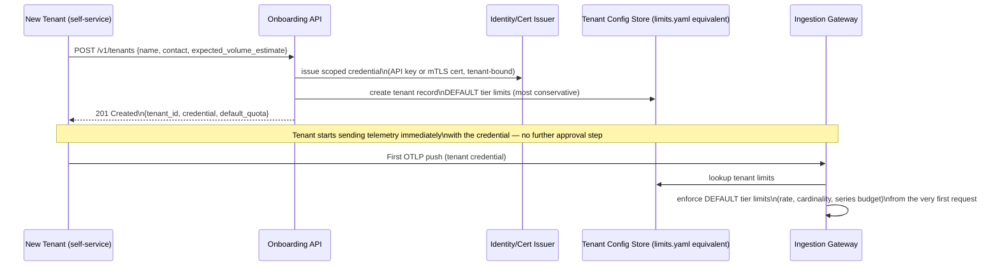
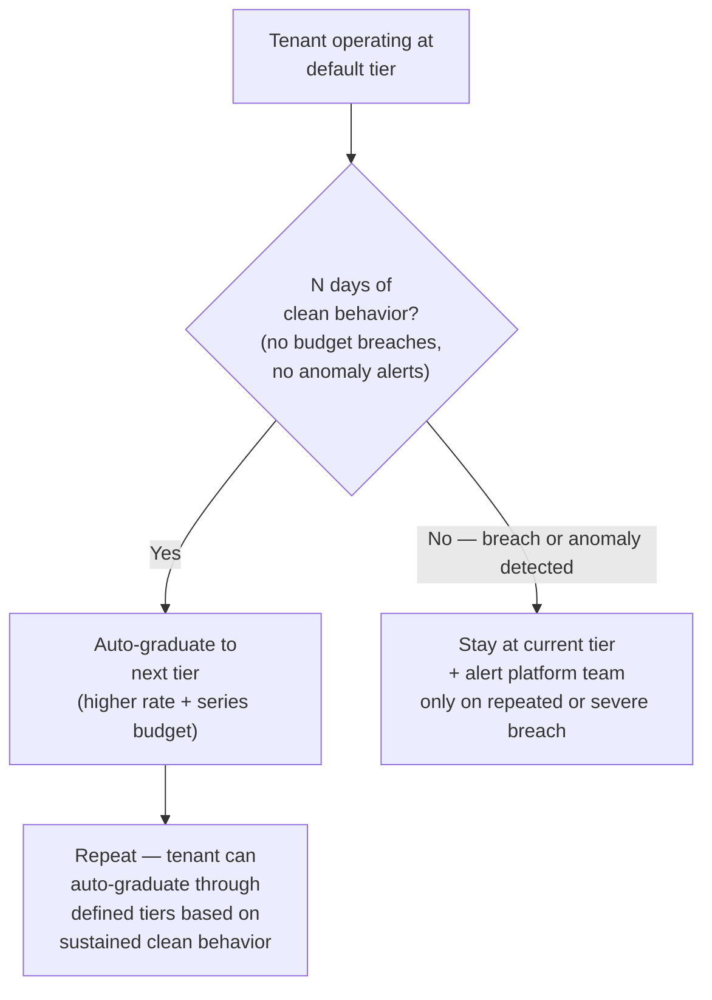

## Q10: Self-Service Tenant Onboarding

> **Prompt:** Design self-service tenant onboarding: a new tenant should be able to start sending
> telemetry via an API call with zero platform-team involvement, while the platform still protects
> itself from a misbehaving or malicious new tenant on day one.

> **The examiner's intent:** This is a trust-bootstrapping problem. The bar is recognizing that
> "self-service" and "protect shared infrastructure" are in tension by default — self-service means
> no human reviews the request before it's granted, so every protection has to be automatic,
> default, and enforced _before_ the tenant ever sends their first byte, not reactively after.

---

## Step 1: Clarify Requirements

**What does "zero platform-team involvement" cover exactly?**

- The onboarding API call itself (create tenant, get credentials) — fully automated, no human in the
  loop.
- Does NOT mean zero platform _policy_ — defaults and guardrails are set by the platform team once,
  applied automatically to every new tenant. The distinction: no human approval per tenant, but
  every tenant still operates inside limits the platform team defined in advance.

**What's the trust model on day one?**

- A brand-new tenant has no track record. Assume **zero trust by default**: every new tenant starts
  at the most conservative tier of every limit, and earns expanded quota through observed good
  behavior, not through a one-time provisioning request.

**Scope:**

- Onboarding = identity provisioning + default quota assignment + first-write validation. Not in
  scope: billing integration, tenant offboarding — call these out as related but separate concerns.

---

## Step 2: Onboarding Flow

**Key design choice:** the credential issued at step 1 is already scoped to the most conservative
default tier — there is no window between "tenant is created" and "tenant is protected." A common
mistake is provisioning identity first and applying limits later (e.g., in a follow-up async job);
that gap is exactly where a malicious or misconfigured tenant could do damage before any guardrail
applies.

---

## Step 3: Default Tier — What "Most Conservative" Means Concretely

| Limit                        | Default (new tenant, day 1)                          | Rationale                                                                                                                                        |
| ---------------------------- | ---------------------------------------------------- | ------------------------------------------------------------------------------------------------------------------------------------------------ | ------------------------------------------------------------------- |
| Ingestion rate (samples/sec) | Low fixed ceiling (e.g., 10K/sec)                    | Below what any single misbehaving process could use to meaningfully impact shared ingesters                                                      |
| Active series budget         | Small (e.g., 100K series)                            | Bounds the cardinality-storm blast radius described in [[05-27-q2-answer-cardinality-storm-detection-mitigation                                  | Q2]] to a size that can't meaningfully affect shared infrastructure |
| Ingester shard assignment    | Shuffle-sharded into the smallest tenant tier's pool | New tenant's spike (even at max default) is contained to a bounded ingester subset, per [[05-27-q2-answer-cardinality-storm-detection-mitigation | Q2]]'s isolation mechanism                                          |
| Retention                    | Shortest supported tier                              | Limits storage cost exposure before the tenant is validated as legitimate                                                                        |
| Gateway connection count     | Capped per credential                                | Prevents a single compromised credential from opening unbounded connections — ties into [[05-36-q11-answer-compromised-agent-threat-model        | Q11]]'s threat model                                                |

This tier is intentionally tight enough that even a **fully malicious** new tenant operating at its
ceiling cannot meaningfully degrade shared infrastructure — the "protect the platform" requirement
is satisfied by the default being safe, not by any reactive detection.

---

## Step 4: Graduation — Earning Expanded Quota Without a Human Gate

Self-service onboarding shouldn't mean the tenant is stuck at the minimal tier forever — that would
just push the "please expand my quota" request back to a human, defeating the "zero platform-team
involvement" goal for legitimate tenants who outgrow the default.

This reuses the detection machinery from
[[05-27-q2-answer-cardinality-storm-detection-mitigation|Q2]] (cardinality anomaly detection,
rate-of-change monitoring) as the graduation signal, not just an incident-response signal — a tenant
with N days of no budget breaches and no anomaly flags automatically moves to the next tier. **The
platform team is only pulled in when automatic graduation logic itself flags something ambiguous**
(e.g., a tenant repeatedly bumping against a limit in a way that looks like organic growth rather
than misbehavior) — this preserves "zero involvement" for the overwhelming majority of legitimate
onboarding while keeping a human escalation path for the genuinely ambiguous cases.

---

## Step 5: Protecting Against Malicious Onboarding Itself

Self-service onboarding is also an attack surface: nothing stops an attacker from calling the
onboarding API repeatedly to create many tenants (identity-provisioning abuse) or providing a
plausible-looking `expected_volume_estimate` to try to get a higher initial tier.

| Protection                                                                                                | What it prevents                                                                                                                                         |
| --------------------------------------------------------------------------------------------------------- | -------------------------------------------------------------------------------------------------------------------------------------------------------- |
| Onboarding API itself is rate-limited (per source IP/org account, not per tenant)                         | Prevents mass-creation of fake tenants to exhaust identity/config store capacity                                                                         |
| `expected_volume_estimate` is informational only — never used to grant a higher-than-default initial tier | Removes the incentive to lie on the intake form; trust is earned post-onboarding, not claimed at onboarding                                              |
| Onboarding requires an authenticated org identity (e.g., SSO-backed account), not an anonymous API call   | Ties every tenant back to a real, accountable identity — makes abuse traceable, not just rate-limited                                                    |
| New tenant IDs/credentials are logged and surfaced on a platform-team dashboard (visibility, not a gate)  | Platform team retains observability into onboarding volume without being in the approval path — satisfies "zero involvement" while not being blind to it |

---

## Step 6: Observability

| Signal                                             | Purpose                                                                                                                                                                           |
| -------------------------------------------------- | --------------------------------------------------------------------------------------------------------------------------------------------------------------------------------- |
| `tenant_onboarding_total{result}`                  | Volume and success/failure rate of the self-service flow itself                                                                                                                   |
| `tenant_tier_graduation_total{from_tier, to_tier}` | Confirms auto-graduation is working — legitimate tenants aren't stuck at the minimal tier                                                                                         |
| `tenant_default_tier_budget_breach_total{tenant}`  | Directly measures whether the "protect the platform" requirement is holding — should stay near-zero impact on shared infra even when tripped, by construction of the default tier |
| Onboarding API's own rate-limit rejection count    | Confirms the abuse-prevention layer (Step 5) is active, not just theoretical                                                                                                      |

---

## Summary

| Requirement                                          | Design answer                                                                                                                         |
| ---------------------------------------------------- | ------------------------------------------------------------------------------------------------------------------------------------- |
| Zero platform-team involvement per tenant            | Fully automated API: identity + default quota issued atomically in one call                                                           |
| Protect shared infra from a malicious new tenant     | Default tier deliberately conservative enough that even a malicious tenant at ceiling can't meaningfully impact shared infrastructure |
| No permanent quota starvation for legitimate tenants | Auto-graduation through tiers based on sustained clean behavior, reusing existing anomaly detection                                   |
| Onboarding API itself as an attack surface           | Rate-limited, authenticated-identity-gated, informational-only volume estimates                                                       |
| Platform team visibility without being a gate        | Dashboard-level observability into onboarding and graduation events                                                                   |

---

## Trade-offs Stated (What to Say Out Loud)

**"The trust model has to be zero-trust by default, because self-service means nobody reviews the
request before it's granted."** Any design that relies on a human spot-checking new tenants
periodically isn't actually self-service — it's just delayed human involvement.

**"I deliberately don't let the tenant's own volume estimate influence their starting tier."** That
field exists for the tenant's and platform's planning visibility, not as a trust signal — using it
to grant a higher day-one tier creates a direct incentive to misrepresent it, which undermines the
whole protection model.

**"Auto-graduation reuses the exact same anomaly detection built for incident response — that's not
a coincidence, it's the same trust signal serving two purposes."** Building a separate "is this
tenant trustworthy" system from scratch would duplicate work the platform already needs for
[[05-27-q2-answer-cardinality-storm-detection-mitigation|Q2]]'s cardinality-storm detection.

**"The one place I keep a human escalation path is when graduation logic itself is ambiguous, not on
every onboarding."** This preserves the "zero involvement" promise for the common case while not
pretending every edge case can be resolved by a rule.

---

## Related

- [[05-01-telemetry-ingestion-pipeline|Telemetry Ingestion Pipeline (full design)]] — §3.6
  (multi-tenancy, quota enforcement points)
- [[05-27-q2-answer-cardinality-storm-detection-mitigation|Q2: Cardinality Storm Detection and Mitigation]]
- [[05-36-q11-answer-compromised-agent-threat-model|Q11: Compromised Agent Threat Model]]
