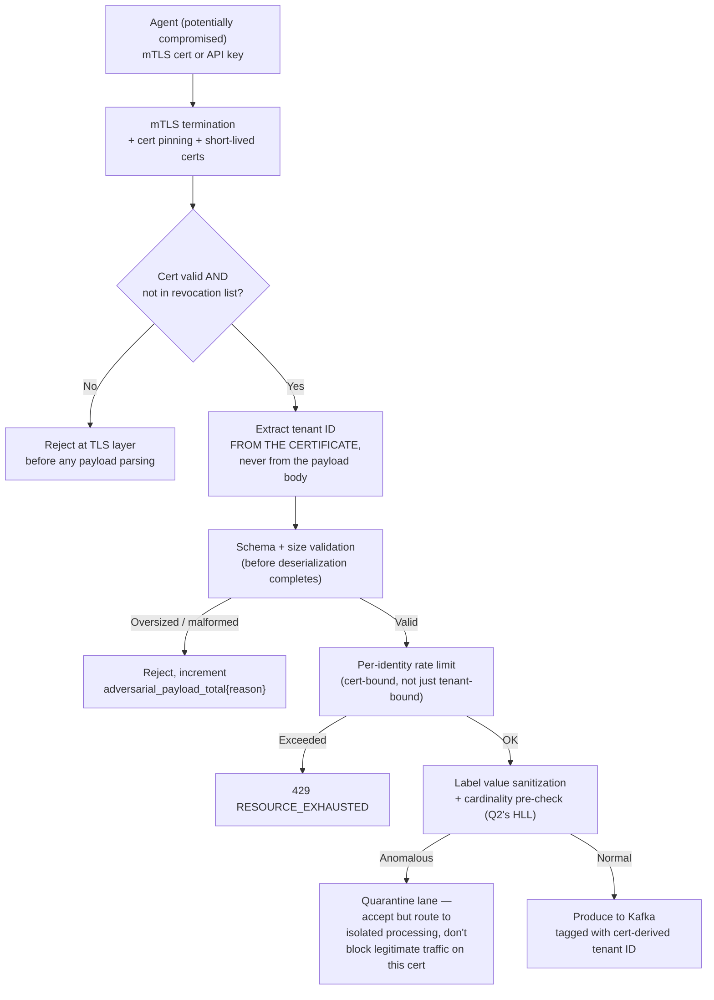

## Q11: Ingestion Frontier Under a Compromised-Agent Threat Model

> **Prompt:** Assume a compromised agent is sending malformed and adversarial payloads — oversized
> batches, spoofed tenant IDs, garbage label values. Redesign the ingestion frontier for this threat
> model.

> **The examiner's intent:** Moves the design conversation from "how do we handle legitimate scale"
> to "what do we do when an identity we trusted turns hostile." The bar is naming a specific threat
> model per attack vector (not "add auth") and being explicit about which existing pipeline
> mechanisms already double as defenses versus what's genuinely new.

---

## Step 1: Define the Threat Model Precisely

"Compromised agent" means: the credential (mTLS cert or API key) is valid and belongs to a real
tenant — this is not an unauthenticated attacker, it's an **insider threat from a legitimately
provisioned identity** that has been compromised (stolen cert, malicious code injected into a
sidecar, supply-chain compromise of the agent binary itself). This distinction matters: auth alone
does not solve this, because the attacker _has_ valid auth.

**Named attack vectors from the prompt, each needing a distinct defense:**

1. Oversized batches — resource-exhaustion attack against the gateway or Kafka
2. Spoofed tenant IDs — an attempt to write into another tenant's namespace, corrupting their data
   or evading that agent's own tenant's rate limits
3. Garbage label values — either a cardinality-storm attack (see
   [[05-27-q2-answer-cardinality-storm-detection-mitigation|Q2]]) deliberately triggered, or an
   attempt to inject something a downstream system mishandles (label values reaching a query, a
   dashboard, or a log line unsanitized)

---

## Step 2: Redesigned Frontier



### Defense 1: Tenant ID comes from the certificate, never from the payload

This is the single most important design change for the "spoofed tenant ID" vector. The current
design's baseline ([[05-04-layer-1-ingestion-frontier|§3.1]]) already authenticates via mTLS/API key
and identifies the tenant — the redesign makes explicit that **tenant identity must be derived
exclusively from the authenticated credential** (the cert's subject/SAN, or the API key's bound
tenant mapping), and any `tenant_id` field present in the OTLP payload body itself is either ignored
entirely or, if present, must exactly match the cert-derived tenant or the request is rejected
outright. A compromised agent cannot spoof a different tenant's ID no matter what it puts in the
payload, because the payload's claim is never trusted.

### Defense 2: Size and schema validation before full deserialization

Oversized batches are a resource-exhaustion attack against the gateway (CPU/memory to deserialize)
and against Kafka (`max.message.bytes`, already a named gotcha in
[[05-05-layer-2-durable-buffer-kafka|§3.2]] of the main design — but there it's framed as an
operational limit, not an adversarial one). The redesign: validate payload size against a hard
ceiling **before** full protobuf deserialization begins, using just the wire-level length prefix —
this bounds the cost of a malicious oversized batch to a cheap length check, not a full parse
attempt.

```yaml
# Gateway config — reject before deserialization, not after
max_request_body_bytes: 4194304        # 4MB hard ceiling, enforced at the transport layer
grpc_max_recv_msg_size: 4194304        # gRPC-level enforcement, same ceiling
```

### Defense 3: Per-identity (not just per-tenant) rate limiting

If rate limiting is only applied per-tenant, a compromised single agent within a large tenant with
many agents can consume that tenant's _entire_ rate budget, denial-of-servicing every other
legitimate agent under the same tenant. Add a second, tighter limit bound to the **individual
credential/cert**, not just the tenant aggregate — this bounds the blast radius of one compromised
agent to its own slice of the tenant's traffic, protecting the tenant's _other_, uncompromised
agents from being starved by their own teammate's compromised one.

### Defense 4: Garbage label values — sanitize and pre-check cardinality, quarantine don't drop-silently

Garbage label values are dangerous in two distinct ways: (a) they can trigger a cardinality storm
deliberately (weaponizing [[05-27-q2-answer-cardinality-storm-detection-mitigation|Q2]]'s failure
mode as an attack rather than an accident), and (b) certain characters/lengths in label values can
cause downstream issues if they ever reach a query string, a log line, or a dashboard unsanitized (a
lower-severity but real injection-adjacent concern). Redesign response:

- Apply the same HLL-based cardinality pre-check from
  [[05-27-q2-answer-cardinality-storm-detection-mitigation|Q2]] inline at the gateway/processor
  boundary, but now framed as an adversarial control, not just a noisy-neighbor control — same
  mechanism, different threat model.
- Enforce a hard max length and an allowed-character set on label values before they're accepted
  (reject control characters, cap length to a few hundred bytes) — cheap validation that removes an
  entire class of downstream mishandling risk.
- Route anomalous-but-not-yet-confirmed-malicious traffic to a **quarantine lane**: accepted, but
  processed in isolation (separate Kafka topic/partition, separate processor pool) so it can't
  contend for resources with legitimate traffic while security/platform teams investigate — better
  than an outright silent drop, which would hide the forensic trail of what the compromised agent
  was attempting.

---

## Step 3: What Already Existed and Just Needed Reframing

Worth naming explicitly in the interview — several defenses aren't new, they're existing mechanisms
whose _purpose_ shifts under this threat model:

| Existing mechanism (built for scale/reliability)                                              | New purpose under this threat model                                                                      |
| --------------------------------------------------------------------------------------------- | -------------------------------------------------------------------------------------------------------- | -------------------------------------------------------------------------------------------------------------- |
| Per-tenant cardinality budget (§3.3, [[05-27-q2-answer-cardinality-storm-detection-mitigation | Q2]])                                                                                                    | Now also a defense against deliberate cardinality-storm weaponization                                          |
| `max.message.bytes` limit (§3.2)                                                              | Now a resource-exhaustion defense, not just an operational tuning knob                                   |
| Multi-tenancy isolation layers ([[05-09-multi-tenancy                                         | §3.6]])                                                                                                  | Now the containment boundary for a compromised single tenant's blast radius, not just noisy-neighbor isolation |
| OTLP PartialSuccess signal (§3.1)                                                             | Now doubles as a forensic signal — a spike in partial rejections from one cert is a compromise indicator |

This reframing matters for the interview because it shows the security redesign isn't bolted on —
much of the resilience architecture already built for reliability reasons directly serves a security
purpose once you assume an adversarial actor.

---

## Step 4: Observability — Detecting Compromise, Not Just Rejecting Bad Payloads

| Signal                                                               | Purpose                                                                                                              |
| -------------------------------------------------------------------- | -------------------------------------------------------------------------------------------------------------------- |
| `telemetry_gateway_adversarial_payload_total{reason, cert_id}`       | Per-credential breakdown — repeated rejections from one specific cert is the compromise signal, not aggregate volume |
| `telemetry_gateway_tenant_id_mismatch_total{cert_id}`                | Direct signal for spoofing attempts — should be zero under normal operation, any nonzero value is actionable         |
| `telemetry_gateway_per_identity_rate_limit_triggered_total{cert_id}` | Distinguishes "this one agent is compromised" from "this tenant is legitimately scaling up"                          |
| Quarantine lane volume, by cert_id                                   | Feeds directly into a cert-revocation decision — sustained quarantine volume from one cert is grounds to revoke it   |

**Alert to add:**

```promql
# A single credential repeatedly failing validation is a much stronger signal
# than aggregate rejection volume across all agents
sum by (cert_id) (rate(telemetry_gateway_adversarial_payload_total[5m])) > 10
```

This should page security/platform on-call to consider **cert revocation** for that specific
identity — the actual containment action, not just alerting for its own sake.

---

## Summary

| Attack vector               | Defense                                                                                                |
| --------------------------- | ------------------------------------------------------------------------------------------------------ |
| Oversized batches           | Hard size ceiling checked at transport layer, before deserialization                                   |
| Spoofed tenant IDs          | Tenant ID derived exclusively from the authenticated cert, payload claims ignored/verified             |
| Garbage label values        | Length/charset validation + cardinality pre-check + quarantine lane, not silent drop                   |
| Compromised agent generally | Per-identity (not just per-tenant) rate limiting bounds one agent's blast radius within its own tenant |
| Detection                   | Per-cert rejection-rate monitoring feeds a concrete cert-revocation decision                           |

---

## Trade-offs Stated (What to Say Out Loud)

**"The core move is refusing to trust anything in the payload body that the credential itself should
determine — tenant ID above all."** Once you accept that a compromised agent still holds valid auth,
every field it controls (not just the label values, the tenant claim too) has to be treated as
untrusted.

**"I'd add a quarantine lane instead of a silent drop for ambiguous cases."** A hard reject is right
for clearly malformed payloads (oversized, bad schema); for adversarial-but-plausible traffic
(garbage-but-well-formed labels), preserving a forensic trail in an isolated lane is more valuable
than erasing the evidence of what the compromised agent was trying to do.

**"Per-identity rate limiting is the piece most designs miss, because per-tenant limiting looks
sufficient until you remember one tenant has many agents."** Without it, a compromised single agent
can deny service to its own teammates under the same tenant — a blast radius the per-tenant limit
alone doesn't bound.

**"Several of these defenses already existed for reliability reasons — I wouldn't claim credit for
inventing new mechanisms where the honest answer is that the threat model just gives existing
mechanisms a second job."**

---

## Related

- [[05-01-telemetry-ingestion-pipeline|Telemetry Ingestion Pipeline (full design)]] — §3.1
  (ingestion frontier), §3.2 (Kafka producer gotchas), §3.6 (multi-tenancy)
- [[05-27-q2-answer-cardinality-storm-detection-mitigation|Q2: Cardinality Storm Detection and Mitigation]]
- [[05-35-q10-answer-self-service-tenant-onboarding|Q10: Self-Service Tenant Onboarding]]
