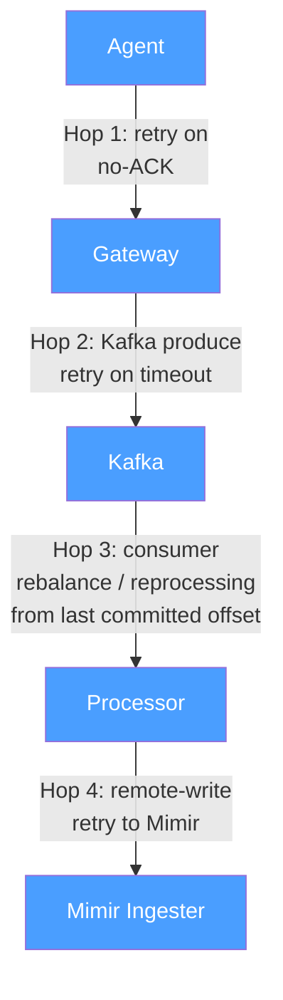
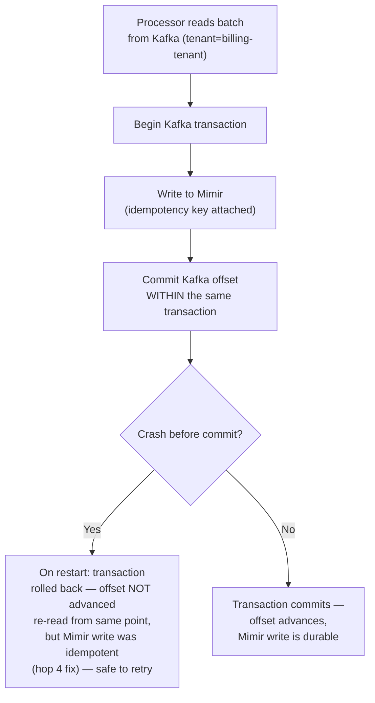

## Q12: Mixed Delivery Semantics — Exactly-Once for One Tenant Only

> **Prompt:** You must support exactly-once ingestion for one tenant because their metric samples
> drive billing, while every other tenant stays at-least-once. Where in the pipeline does that
> requirement have to be enforced, and what does it cost you?

> **The examiner's intent:** Tests whether you understand that delivery semantics are not a single
> pipeline-wide switch — they're a property that must hold at _every_ hop, and a per-tenant
> exception means threading that guarantee through multiple independently-owned components without
> touching the shared path for everyone else. The bar is naming every hop where "at-least-once"
> would silently break exactly-once if left unchanged, and being honest about the real cost.

---

## Step 1: Clarify Requirements

**Why does billing need exactly-once specifically?**

- At-least-once with downstream deduplication (the pipeline's default, per
  [[05-05-layer-2-durable-buffer-kafka|§3.2]] of the main design) is fine when a duplicate sample is
  either idempotent (TSDB dedups by timestamp + label fingerprint) or low-stakes if occasionally
  imperfect. Billing is different: if a duplicate sample is double-counted anywhere before
  deduplication happens, the tenant is billed twice for the same usage — a correctness bug with a
  dollar amount attached, not just a data-quality nit.

**Where exactly does the money get computed?**

- Assume billing reads aggregated values from Mimir (e.g., a monthly `sum_over_time` of a usage
  counter) — so "exactly-once" has to hold from the agent all the way to the value Mimir stores, not
  just at one hop.

**What's explicitly NOT required:**

- Other tenants' guarantees are unaffected — this is a targeted, per-tenant change, not a
  pipeline-wide migration to exactly-once (which the main design already argues against as
  disproportionately expensive, §3.2).

---

## Step 2: Map Every Hop Where At-Least-Once Would Break This



Every one of these four hops is a place a retry can create a duplicate under the pipeline's default
at-least-once design:

1. **Agent → Gateway:** agent retries on ambiguous failure (e.g., it sent the batch, gateway
   processed it, but the ACK was lost in transit) — the agent cannot distinguish "my request never
   arrived" from "it arrived but the response didn't," so it retries either way, which is the
   correct at-least-once behavior everywhere else but a duplicate risk here.
2. **Gateway → Kafka:** the gateway's producer retries on a timeout that may have actually succeeded
   (message landed, ACK was delayed) — `enable.idempotence: true` (already the default producer
   config per §3.2) solves this specific hop for free, because Kafka's idempotent producer dedupes
   retries **at the partition level** using a producer ID + sequence number. This hop is actually
   already exactly-once by default — worth stating explicitly rather than treating every hop as
   equally in need of new work.
3. **Kafka → Processor:** on processor restart/rebalance, consumption resumes from the last
   **committed** offset — if the processor had written to Mimir but crashed _before_ committing the
   offset, it will reprocess and re-write that batch on restart. This is the hop where at-least-once
   is structural, not just a retry edge case, and needs a real fix.
4. **Processor → Mimir:** the processor's remote-write client retries on timeout, same ambiguous
   "did it land" problem as hop 1.

---

## Step 3: The Fix — Per-Tenant Exactly-Once, Hop by Hop

### Hop 1 (agent → gateway) and Hop 4 (processor → Mimir): idempotency keys

Both hops share the same fix pattern: attach a **deterministic idempotency key** to each batch
(e.g., a hash of `tenant_id + series + timestamp + value`, or an agent-generated batch UUID), and
have the receiving side (gateway for hop 1, Mimir ingester for hop 4) recognize and silently no-op a
retry carrying a key it has already processed within a bounded window.

```
idempotency_key = hash(tenant_id, metric_name, label_set, timestamp)
```

This only needs to be enabled **for this tenant's traffic specifically** — the gateway and the
remote-write path both already carry `tenant_id` on every request ([[05-09-multi-tenancy|§3.6]]), so
the idempotency check can be a tenant-scoped code path, not a pipeline-wide behavior change. Other
tenants' requests skip this check entirely and keep the cheaper default behavior.

### Hop 2 (gateway → Kafka): already solved

`enable.idempotence: true` is already the standing producer config (§3.2) — the Kafka producer's
built-in idempotent-produce guarantee covers this hop for every tenant already, at no incremental
cost. Naming this explicitly in the interview is a signal that you're not proposing to re-solve a
problem that's already handled.

### Hop 3 (Kafka → Processor): exactly-once via transactional offset commit

This is the hop that requires real architectural work. Use **Kafka transactions**: the processor
must commit its consumer offset and its write to Mimir as a single atomic unit, so a crash between
"wrote to Mimir" and "committed the offset" cannot happen — either both happened or neither did.



Practically, this means running a **dedicated consumer group instance for this one tenant's topic
partition(s)**, configured with `isolation.level: read_committed` and Kafka transactional producer
semantics, separate from the shared at-least-once consumer group serving every other tenant. This is
the direct answer to "where does it have to be enforced": **isolated at the consumer-group level,
not threaded through the shared processor fleet's default code path.**

---

## Step 4: What This Costs

| Cost                                           | Why                                                                                                                                                                                                                                                                 |
| ---------------------------------------------- | ------------------------------------------------------------------------------------------------------------------------------------------------------------------------------------------------------------------------------------------------------------------- | -------------------------------------------------- |
| **Latency** — extra ~10-20ms per batch         | Transactional commit (2-phase: write + offset commit) is slower than fire-and-forget at-least-once writes, per the main design's own estimate in [[05-26-q1-answer-500m-ingest-zero-drop-rolling-deploy                                                             | Q1]]'s trade-offs section (~15ms for exactly-once) |
| **Dedicated processing path**                  | A separate consumer group (and likely separate processor pods) just for this tenant — can't share the pool with at-least-once traffic, because transactional semantics change the consumption model for the whole group, not per-message                            |
| **Idempotency key storage**                    | Gateway and Mimir-side idempotency checks need a bounded lookback store (e.g., Redis, TTL'd) to recognize a duplicate key — new operational component, scoped to this tenant's traffic volume only                                                                  |
| **Operational complexity**                     | One tenant's pipeline now behaves differently under failure (transactional rollback + reprocessing) than every other tenant — this is a real maintenance and on-call cognitive cost, not just infrastructure cost                                                   |
| **Reduced throughput ceiling for this tenant** | Transactional producers/consumers in Kafka have a lower practical throughput ceiling than idempotent-only mode — acceptable here because billing volume is presumably much lower than the pipeline's aggregate telemetry volume, but worth confirming, not assuming |

**The honest framing to give:** this is not free, and it should not be the default. The main
design's own stance (§3.2: "only use exactly-once if there is a billing or compliance requirement")
is exactly the right call here — the fix is justified specifically _because_ this one tenant has a
dollar-denominated correctness requirement that the rest of the pipeline doesn't share, and
containing the cost to that tenant's isolated path is what makes the trade-off acceptable.

---

## Step 5: Observability — Proving the Guarantee Holds

| Signal                                                                                              | Purpose                                                                                                             |
| --------------------------------------------------------------------------------------------------- | ------------------------------------------------------------------------------------------------------------------- |
| `telemetry_gateway_idempotency_duplicate_detected_total{tenant}`                                    | Confirms the mechanism is actually catching retries, not just present but unused                                    |
| `mimir_ingester_duplicate_write_rejected_total{tenant}`                                             | Same confirmation at the Mimir-side idempotency check                                                               |
| Kafka consumer group lag, isolated view for this tenant's dedicated group                           | Transactional consumers commit slower — confirm this doesn't silently become a growing backlog                      |
| A monthly reconciliation job: sum of billed usage vs. independently-computed raw agent-side counter | The actual audit — proves the guarantee held over a full billing cycle, not just spot-checked at the pipeline level |

The reconciliation job matters more than any single pipeline metric here: billing correctness is
ultimately proven by comparing what was billed against an independent source of truth, not by
trusting the pipeline's own internal counters.

---

## Summary

| Hop               | At-least-once default                | Fix for this tenant                                                                     |
| ----------------- | ------------------------------------ | --------------------------------------------------------------------------------------- |
| Agent → Gateway   | Retry on ambiguous ACK               | Idempotency key, gateway-side dedup, tenant-scoped                                      |
| Gateway → Kafka   | Retry on producer timeout            | Already solved — `enable.idempotence: true` (existing config, no change)                |
| Kafka → Processor | Reprocess from last committed offset | Kafka transactions — write + offset commit as one atomic unit, dedicated consumer group |
| Processor → Mimir | Retry on remote-write timeout        | Idempotency key, Mimir-side dedup, tenant-scoped                                        |

---

## Trade-offs Stated (What to Say Out Loud)

**"One hop is already solved by config that exists today — I wouldn't propose new work for hop 2."**
Kafka's idempotent producer already covers the gateway-to-Kafka hop for every tenant; recognizing
that is as important as identifying the hops that actually need new work.

**"The Kafka-to-processor hop is the one that needs real architecture, and it needs to be isolated
to a dedicated consumer group, not threaded into the shared processor fleet's default path."**
Mixing transactional and non-transactional consumption in the same consumer group isn't how Kafka's
transaction model works — this has to be a genuinely separate path, which is also what keeps the
cost contained to one tenant.

**"I'd be explicit that this costs real latency and operational complexity, and that's the correct
trade specifically because it's scoped to one tenant with a dollar-denominated correctness
requirement."** Applying this pipeline-wide "just in case" would be the wrong call — the main
design's own stance on exactly-once being disproportionately expensive still holds for every other
tenant.

**"The real proof of correctness is a reconciliation job against an independent counter, not a
pipeline-internal metric."** Any bug in the exactly-once mechanism itself would still show as
internally-consistent metrics — only comparing against a source of truth outside the pipeline
catches that class of failure.

---

## Related

- [[05-01-telemetry-ingestion-pipeline|Telemetry Ingestion Pipeline (full design)]] — §3.2 (Kafka
  exactly-once vs at-least-once), §3.6 (multi-tenancy)
- [[05-22-retry-policies|Retry Policies and the Delivery Semantics They Produce]] — the underlying
  mechanics (retry triggers, backoff, idempotent producers, transactional consume-process-produce)
  this answer applies per-tenant
- [[05-26-q1-answer-500m-ingest-zero-drop-rolling-deploy|Q1: 500M Ingest, Zero Drop]]
- [[05-34-q9-answer-cost-reduction-40-percent|Q9: Cost Reduction 40%]]
